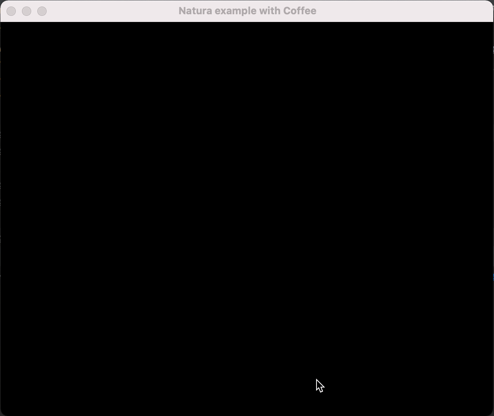

# Natura 
A simple, efficient spring animation library for smooth, natural motion in Rust



## Usage

Harmonica is framework-agnostic and works well in 2D and 3D contexts. Simply call [`Spring::new`](https://github.com/ziyasal/natura/blob/main/natura/src/spring.rs#L138) with your settings to initialize and [`update`](https://github.com/ziyasal/natura/blob/main/natura/src/spring.rs#L171) on each frame to animate.

For details, see the [examples](/examples)

### Examples
- `cargo run -p simple`
```rust
// A thing we want to animate.
#[derive(Default)]
struct Sprite {
    x: f64,
    x_velocity: f64,
    y: f64,
    y_velocity: f64,
}

// Where we want to animate it.
const TARGET_X: f64 = 50.0;
const TARGET_Y: f64 = 100.0;

fn main() {
    let mut sprite = Sprite::default();
 
    // initialize a spring with frame-rate, angular frequency, and damping values.
    let mut spring = Spring::new(natura::fps(60), 6.0, 0.5);

    loop {
        let (sprite_x, sprite_x_velocity) = spring.update(sprite.x, sprite.x_velocity, TARGET_X);
        sprite.x = sprite_x;
        sprite.x_velocity = sprite_x_velocity;

        let (sprite_y, sprite_y_velocity) = spring.update(sprite.y, sprite.y_velocity, TARGET_Y);
        sprite.y = sprite_y;
        sprite.y_velocity = sprite_y_velocity;

        sleep(Duration::from_millis(10000));

        // use new position here on every frame
        println!(
            "Sprite x:{}, y:{}, x_vel:{}, y_vel:{}",
            sprite.x, sprite.y, sprite.x_velocity, sprite.y_velocity
        )
    }
}
```

- `cargo run -p coffee-2d`  
Example with [2D engine `coffee`](https://github.com/hecrj/coffee)

## Settings

`Spring::new` takes three values:

* **Time Delta:** the time step to operate on. Game engines typically provide
  a way to determine the time delta, however if that's not available you can
  simply set the framerate with the included [`fps(u64)`](https://github.com/ziyasal/natura/blob/main/natura/src/spring.rs#L105) utility function. Make
  the framerate you set here matches your actual framerate.
* **Angular Velocity:** this translates roughly to the speed. Higher values are
  faster.
* **Damping Ratio:** the springiness of the animation, generally between `0`
  and `1`, though it can go higher. Lower values are springier. For details,
  see below.

## Damping Ratios

The damping ratio affects the motion in one of three different ways depending
on how it's set.

### Under-Damping

A spring is under-damped when its damping ratio is less than `1`. An
under-damped spring reaches equilibrium the fastest, but overshoots and will
continue to oscillate as its amplitude decays over time.

### Critical Damping

A spring is critically-damped the damping ratio is exactly `1`. A critically
damped spring will reach equilibrium as fast as possible without oscillating.

### Over-Damping

A spring is over-damped the damping ratio is greater than `1`. An over-damped
spring will never oscillate, but reaches equilibrium at a slower rate than
a critically damped spring.

## Acknowledgements

This library is a fairly straightforward port of [Ryan Juckett][juckett]’s
excellent damped simple harmonic oscillator originally writen in C++ in 2008
and published in 2012. [Ryan’s writeup][writeup] on the subject is fantastic.

[juckett]: https://www.ryanjuckett.com/
[writeup]: https://www.ryanjuckett.com/damped-springs/

## License

[MIT](https://github.com/ziyasal/natura/blob/main/LICENSE)
